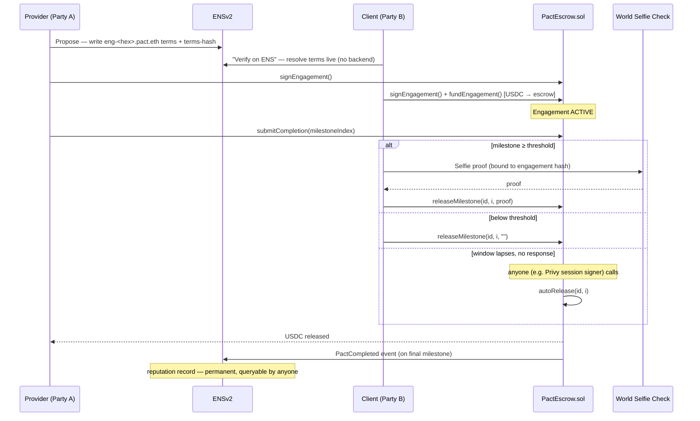
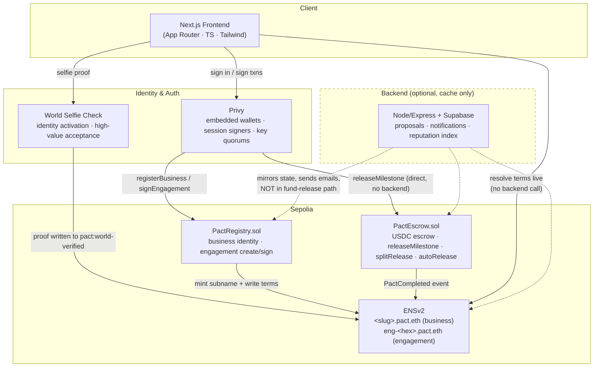

# Pact - Mutual B2B Engagement, On-Chain

Pact is a decentralized engagement platform where two businesses propose, commit, and settle work in USDC with terms on ENS, escrow enforced on-chain, and reputation that's owned by the business, not the platform.

Two parties fund escrow before work starts, verify the exact terms by resolving a public ENS name, and build a permanent track record that survives even if Pact shuts down.

Built for ETHOnline 2026 · Targets ENSv2, Privy, and World Selfie Check tracks.

---

## The Problem It Solves

Two small businesses working together today rely on emailed Word docs, PayPal invoices, and hope:

1. **Disputes over what was agreed** — ~40% of B2B payment delays are documentation disputes. There's no shared source of truth.
2. **Reputation locked to a platform** — Upwork/Fiverr history disappears if the platform bans you or shuts down.
3. **No mutual commitment** — clientflow tools (HoneyBook, Bonsai, Dubsado) are one-sided. The provider sends a contract and hopes the client pays; the client has no skin in the game.

Pact fixes all three: both parties fund USDC escrow before work starts, terms are ENS text records anyone can verify, and reputation is an on-chain event log neither party nor Pact controls.

---
## 🚀 Key Features

📜 **Six Contract Templates** Fixed Delivery, Milestone, Retainer, Time & Materials, Recurring Delivery, and Split Delivery — plus a guided custom builder for anything else.

🔐 **Mutual Commitment** Both parties sign and the client funds USDC escrow before the provider starts work. No one-sided contracts.

🧾 **Terms on ENS, Not PDFs** Every engagement's scope, amount, deadline, and acceptance criteria are ENSIP-5 text records — readable and verifiable by anyone before signing.

⚡ **Backend-Optional Release** releaseMilestone() and autoRelease() are callable directly on-chain by either party's wallet. Pact's server is never required for funds to move.

🏅 **Portable On-Chain Reputation** Every completed engagement emits a PactCompleted event — the reputation record. It lives on the contract, not in Pact's database.

🙋 **Verified Business Identity** World Selfie Check confirms a live human behind each business subname, once at signup and again for high-value milestone releases.



---

## 📜 The Six Templates

| # | Template | Use case | Payment structure |
|---|---|---|---|
| 1 | Fixed Delivery | One deliverable, one price | 50% upfront, 50% on acceptance |
| 2 | Milestone | Phased project (2–5 checkpoints) | Escrowed and released per milestone |
| 3 | Retainer | Reserved monthly capacity | Privy session signer auto-releases monthly |
| 4 | Time & Materials | Hourly/daily rate, flexible scope | Pre-funded ceiling; auto-release after 48h dispute window |
| 5 | Recurring Delivery | Same deliverable every period | Auto-released per period |
| 6 | Split Delivery | Two providers, one client | Atomic on-chain split (basis points) |

A seventh path — a 6-question guided **custom builder** — covers everything else and maps to the nearest template's ENS schema, so every engagement produces the same machine-readable record regardless of how it was created.

---

## 🏗️ Architecture Overview

```
Next.js (App Router, TS, Tailwind) ── Privy embedded wallets/session signers
        │
        ├── PactRegistry.sol   business identity + engagement creation/signing
        ├── PactEscrow.sol     USDC escrow, milestone release, split release
        ├── ENSv2 (Sepolia)    <slug>.pact.eth (business) / eng-<hex>.pact.eth (engagement)
        └── World Selfie Check identity activation + high-value milestone acceptance
```



---

## 🧱 Tech Stack

| Layer | Choice |
|---|---|
| Frontend | Next.js 14 (App Router), TypeScript, Tailwind, `viem` |
| Auth + wallets | Privy — embedded wallets, session signers, key quorums, gas sponsorship |
| Identity/terms | ENSv2 NameWrapper (Sepolia), `@ensdomains/ensjs`, ENSIP-5 text records, EAC fuses |
| Contracts | Solidity ^0.8.24, Foundry |
| Human verification | World Selfie Check browser SDK |
| Backend | Node.js, Express, TypeScript |
| Database | PostgreSQL via Supabase (cache only — on-chain is authoritative) |
| Email | Resend |
| Deployment | Vercel (frontend), Railway (backend), Sepolia (contracts/ENS) |


---

## ⚙️ Setup & Installation

> Contracts and frontend are further along than backend/ENS scripting — check each workspace's own state before assuming parity with the plan below.

```bash
# Contracts
cd contracts
forge install OpenZeppelin/openzeppelin-contracts
forge test -vv
forge create src/PactRegistry.sol:PactRegistry \
  --rpc-url $SEPOLIA_RPC_URL --private-key $DEPLOYER_PRIVATE_KE

# Frontend
cd frontend
npm install
npm run dev
```
## 🔗 Environment Variables

```
SEPOLIA_RPC_URL=
DEPLOYER_PRIVATE_KEY=
PACT_ETH_OWNER_PRIVATE_KEY=
PRIVY_APP_ID=
PRIVY_APP_SECRET=
WORLD_APP_ID=
WORLD_ACTION_ID=
SUPABASE_URL=
SUPABASE_SERVICE_KEY=
RESEND_API_KEY=
USDC_SEPOLIA_ADDRESS=
PACT_REGISTRY_ADDRESS=
PACT_ESCROW_ADDRESS=
```

---
