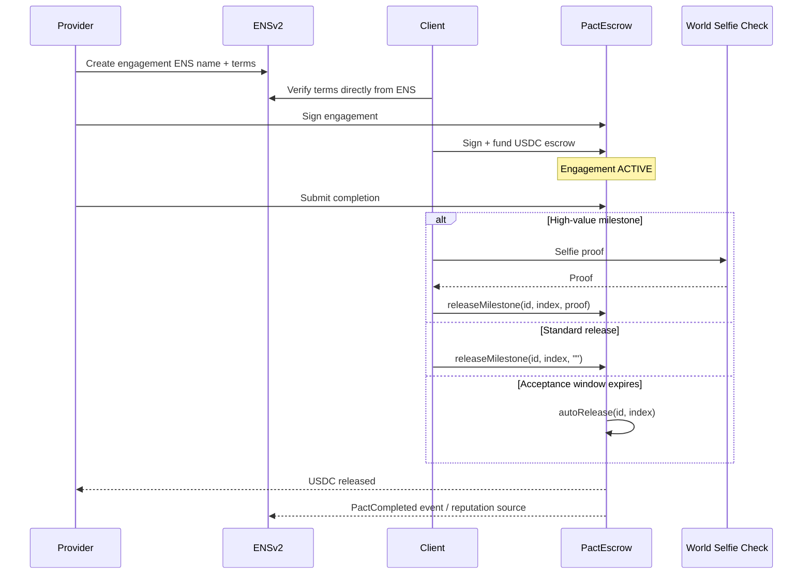

# Pact — Mutual B2B Engagement, On-Chain

Pact is a decentralized B2B engagement platform where businesses can propose, commit, and settle work in USDC with terms stored on ENSv2, escrow enforced on-chain, and reputation that belongs to the business rather than the platform.

Both parties commit before work starts, verify the exact engagement terms from a public ENS name, and build a permanent on-chain track record.

Built for ETHOnline 2026 with ENSv2, Privy, and World Selfie Check.

---

## The Problem

B2B engagements are still handled through documents, invoices, and platform-controlled reputation. That creates three problems:

1. **Terms can be disputed** — the agreed scope and acceptance criteria may be scattered across documents and messages.
2. **Reputation is platform-locked** — business history disappears or becomes unusable when a platform bans a user or shuts down.
3. **Commitment is one-sided** — providers often start work before the client has committed funds.

Pact addresses these with **verifiable ENS terms, mutual USDC escrow, and portable on-chain reputation**.

---

## 🚀 Key Features

📜 **Six Contract Templates** — Fixed Delivery, Milestone, Retainer, Time & Materials, Recurring Delivery, and Split Delivery, plus a guided custom builder.

🔐 **Mutual Commitment** — Both parties sign, and the client funds USDC escrow before work begins.

🧾 **Terms on ENS** — Scope, amounts, deadlines, acceptance criteria, status, and a cryptographic `pact:terms-hash` are stored as ENS text records and can be verified independently.

⚡ **Backend-Optional Release** — Escrow functions such as `releaseMilestone()` and `autoRelease()` can execute directly on-chain; the Pact backend is not required for fund movement.

🏅 **Portable Reputation** — Completed engagements emit `PactCompleted` events that can be queried independently of Pact's database.

🙋 **Verified Business Identity** — World Selfie Check links a verified human to the business identity and can also be used for high-value milestone acceptance.

---

## 🔄 How It Works



---

## 📜 Contract Templates

| # | Template | Use case | Payment structure |
|---|---|---|---|
| 1 | Fixed Delivery | One deliverable, one price | Upfront + acceptance release |
| 2 | Milestone | Phased projects | Per-milestone release |
| 3 | Retainer | Reserved monthly capacity | Automated periodic release |
| 4 | Time & Materials | Hourly/daily work | Pre-funded ceiling + periodic release |
| 5 | Recurring Delivery | Repeated deliverables | Per-period release |
| 6 | Split Delivery | Two providers, one client | Atomic percentage split |

A guided **custom builder** produces structured terms using the same ENS record model.

---

## 🏗️ Architecture

```text
Next.js / React
      │
      ├── Privy
      │    └── Embedded wallets / session signers
      │
      ├── PactRegistry.sol
      │    └── Business identity + engagement creation/signing
      │
      ├── PactEscrow.sol
      │    └── USDC escrow + milestone/auto/split releases
      │
      ├── ENSv2 (Sepolia)
      │    ├── pact-hack.eth
      │    ├── <slug>.pact-hack.eth
      │    └── eng-<hex>.pact-hack.eth
      │
      ├── World Selfie Check
      │    └── Business verification + high-value acceptance
      │
      └── Node/Express + Supabase (optional cache)
           └── Proposals, notifications, indexing
```

### ENSv2 hierarchy

```text
pact-hack.eth
│
├── UserRegistry
│
├── studio.pact-hack.eth
│   └── Business ENS records
│
└── eng-6cf50f.pact-hack.eth
    └── Engagement ENS records
```


---

## 🧱 Tech Stack

| Layer | Choice |
|---|---|
| Frontend | Next.js, React, TypeScript, Tailwind, viem |
| Wallets & Auth | Privy |
| Identity & Terms | ENSv2, ENSIP-5 text records, viem |
| Contracts | Solidity ^0.8.24, Foundry |
| Human Verification | World Selfie Check |
| Backend | Node.js, Express, TypeScript |
| Database | PostgreSQL via Supabase |
| Email | Resend |
| Deployment | Vercel / Railway / Sepolia |

---

## ⚙️ Setup

### Contracts

```bash
cd contracts
forge install OpenZeppelin/openzeppelin-contracts
forge test -vv
```

### Frontend

```bash
cd frontend
npm install
npm run dev
```

### Backend

```bash
cd backend
npm install
```

### ENS / TypeScript workspace

From the project root:

```bash
npm install
```

Do not run the ENS registration/mint scripts against the existing deployed names unless you intentionally need a new deployment.

---

## 🔗 Environment Variables

Create the required variables in your local `.env` file. Do not commit secrets.

```env
SEPOLIA_RPC_URL=
DEPLOYER_PRIVATE_KEY=
PACT_ETH_OWNER_PRIVATE_KEY=
PRIVY_APP_ID=
PRIVY_APP_SECRET=
WORLD_APP_ID=
WORLD_ACTION_ID=
SUPABASE_URL=
SUPABASE_SERVICE_KEY=
RESEND_API_KEY=
USDC_SEPOLIA_ADDRESS=
PACT_REGISTRY_ADDRESS=
PACT_ESCROW_ADDRESS=
```

---
## 🧾 License
This project is licensed under the MIT License.

---

